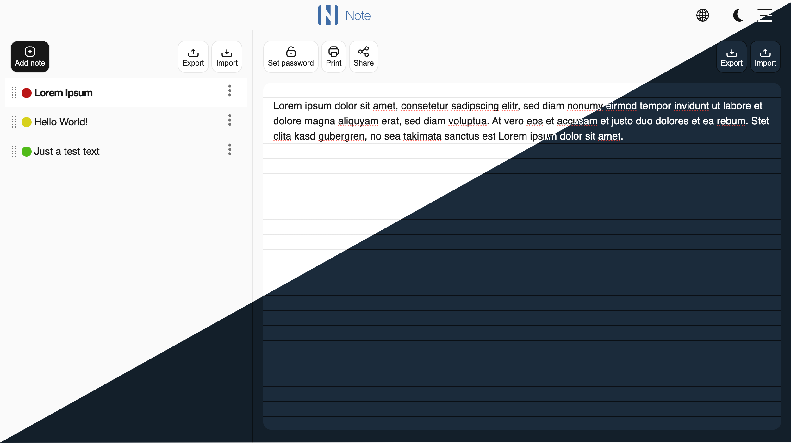
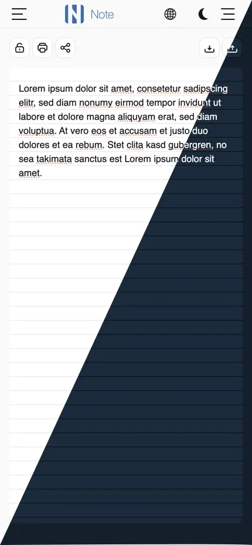

# One File App - Note

A self-hosted, clean and simple notification app based on PHP adn JS. To create, edit and 
manage a notes with browser.

The app is compressed to a single PHP file and csn be used on every web server. 
You need no database.

    <a href="https://ocno.com/_apps/note/">
        ✨Try Demo
    </a>
    <a href="LICENSE.md">
        LicenseMIT
    </a>

## Features

- **One file** App is compressed to single PHP file!
- **Self-hosted** - Ap can be used on own server
- **Responsiive** - Usable on every device
- **Note lists** - All created note are collected to a list
- **Drag And Drop** - You can order the note list per drag and drop
- **Export/Import** - Nnote list and notes can be exported or imported
- **Multilingual** - It's available 3 languages (english, german, russian)
- **Settings** - Some settings are available for notes (background, font, font size)
- **Share** - Notes can be shared
- **Open Graph Protocol** - To share via social networks
- **PWA** - Progressive Web App
- **Password lock** - Define password to save the content stored on server
- **Print** - Note are prepared for printing
- **Dark/light mode** It is available 2 theme to switch
- **Small size** - App is smaller as 200MB!
- **Open & Extensible** - MIT-licensed
- **No framework** - No other framework was used for reducing of app size

## Screenshot

### Desktop version

### Mobile version

## Try the Live Demo

Don't want to install yet? You can try it out [live demo](https://ocno.com/_apps/note/) first!

## License

OFA Note is open-source software licensed under the [MIT License](LICENSE.md). 

---

**[Website](https://ocno.com/_apps/note/)** • **[Demo](https://ocno.com/_apps/note/)** 
